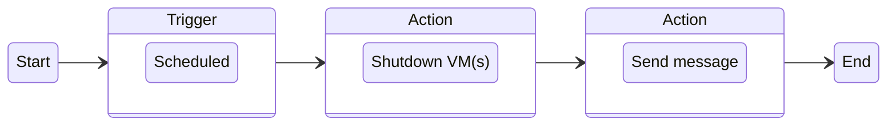
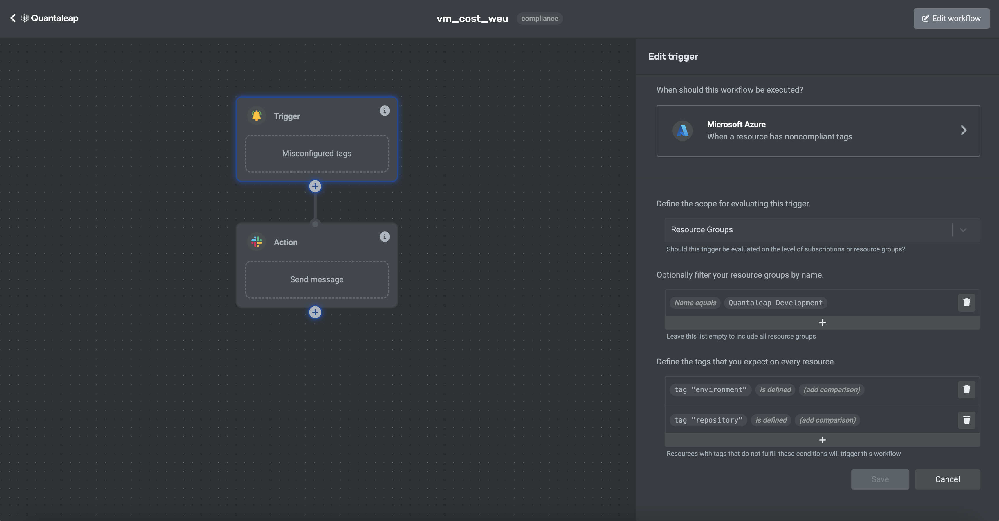

This workflow will send a message to a Slack channel when selected resources do not comply with a specified tagging policy.

## Overview

## Configuration Steps

1. Select the trigger **Alert** > **Microsoft Azure** > **When a resource has noncompliant tags**.
2. Select the action **Slack** > **Send a formatted Slack message to any channel**

## Interface

