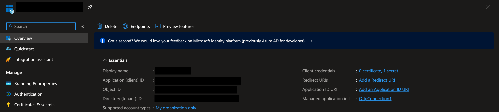
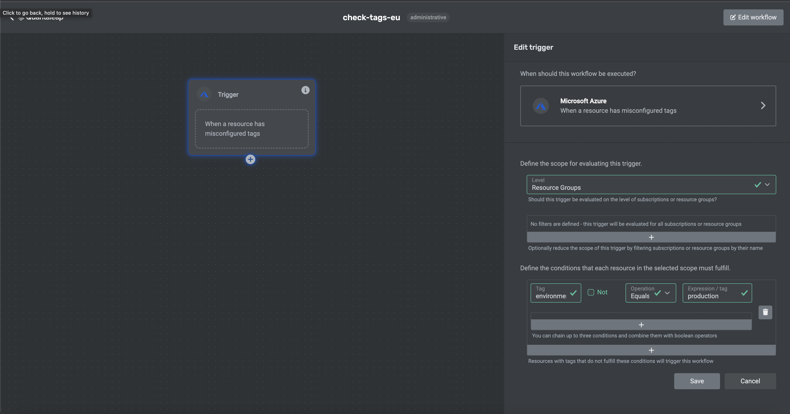

This guide will walk you through getting started with Quantaleap. By the end of this guide, you'll have set up your environment and created your first workflow.

## Request an account

You can request an account from [here](https://sack33mm4m8.typeform.com/to/unzBLsJ5) or by mailing us at [support@quantaleap.eu](mailto:support@quantaleap.eu).

## Connecting your cloud environment

To allow Quantaleap to access your Microsoft Azure resources, you need to configure a single-tenant app registration with the right permissions in your subscription. This can be done by following [these](https://learn.microsoft.com/en-us/azure/active-directory/develop/quickstart-register-app) instructions. The registration will return 3 pieces of information:

- a `tenant ID` (36-character UUID)
- a `client ID` (36-character UUID)
- a `client secret` (arbitrary string)

This information should be provided to Quantaleap. From Microsoft Azure, you can copy these details by visiting **Azure Active Directory** > **App registrations** > `your app name`:

On Quantaleap, you can complete the integration from **Settings** > **Integrations** > **Microsoft Azure**. Copy and paste the app authentication details in the respective fields.

:::caution warning
Don't store the app authentication details in plain text. This data can easily be used to compromise your Microsoft Azure environment.
:::

## Create your first workflow

Once the integration has been succesfully configured, you can get started. Visit **Workflows** > **Create workflow** to create your first workflow. Let's create a demo workflow to check whether any of your resources are lacking administrative tags.

1. Select the **Alert** > **Microsoft Azure** > **Misconfigured tags** trigger:

2. Complete the form with the applicable filters to finetune which resources should be audited.
3. Save the workflow

By clicking the exclamation mark in the top right corner of the trigger node, you can view evaluation logs. This information can be used to debug specific tasks within the workflow.

You can monitor the workflow by visiting **Workflows** > `your workflow`. This summary provides an overview of job executions and results.

Congratulations! You've created and tested your first workflow.
