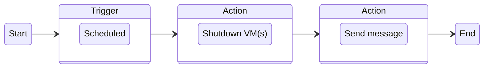
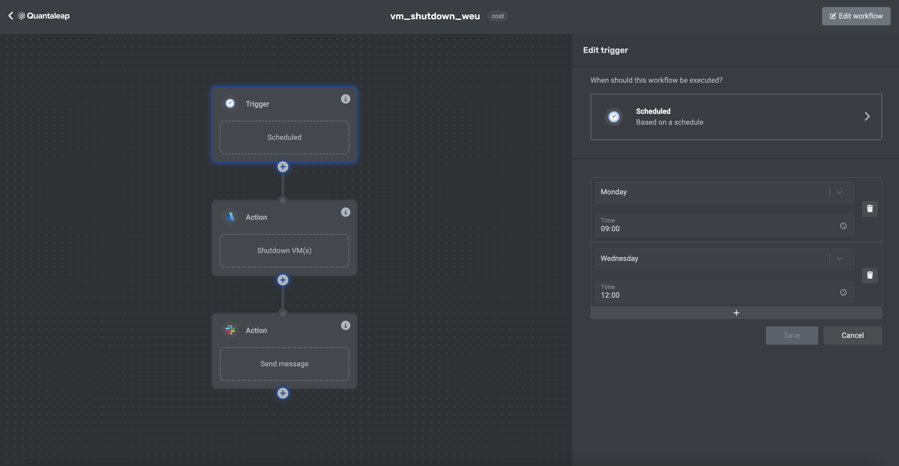

This workflow will shut down a group of virtual machines according to a planned schedule and send a message to a Slack channel.

## Overview

## Configuration Steps

1. Select the trigger **Scheduled** > **Microsoft Azure** > **When a VM shows unusual resource consomption**.
2. Select the action **Microsoft Azure** > **Disable a group of virtual machines**
3. Select the action **Slack** > **Send a formatted Slack message to any channel**

## Interface

