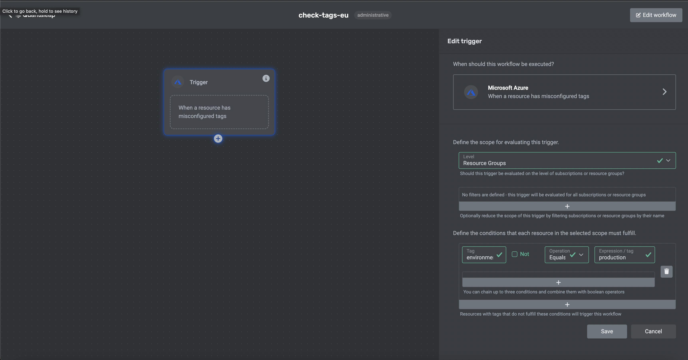
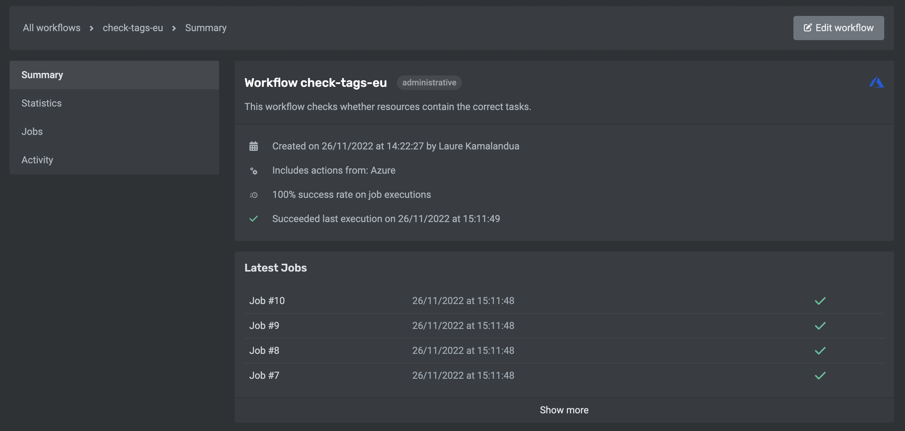

# Getting started

This guide will walk you through getting started with Quantaleap. By the end of this guide, you'll have set up your environment and created your first workflow.

## Request an account

You can request an account from [here](https://sack33mm4m8.typeform.com/to/unzBLsJ5) or by mailing us at support@quantaleap.eu.

## Connecting your cloud environment

To allow Quantaleap to access your Microsoft Azure resources, you need to configure a single-tenant app registration with the right permissions in your subscription. This can be done by following [these](https://learn.microsoft.com/en-us/azure/active-directory/develop/quickstart-register-app) instructions. The registration will return 3 pieces of information:

- a `tenant ID` (36-character UUID)
- a `client ID` (36-character UUID)
- a `client secret` (arbitrary string)

This information should be added to Quantaleap. From Microsoft Azure, you can copy these details by visiting **Azure Active Directory** > **App registrations** > `your app name`:

On Quantaleap, you can complete the integration from **Settings** > **Integrations** > **Microsoft Azure**. Copy and paste the app authentication details in the respective fields.

:::caution warning
Don't store the app authentication details in plain text. This data can easily be used to compromise your Microsoft Azure environment.
:::

## Create your first workflow

Once the integration has been succesfully configured, you can get started. Visit **Workflows** > **Create workflow** to create your first workflow. Let's create a demo workflow to check whether resources miss administrative tags.

1. Select the **Microsoft Azure** > **When a resource has misconfigured tags** trigger:

2. Complete the form with the applicable filters to finetune which resources should be audited.
3. Save the workflow

You can monitor the workflow by visiting **Workflows** > `your workflow`. The summary provides an overview of execution and results.

Congratulations! You've created and tested your first workflow.
